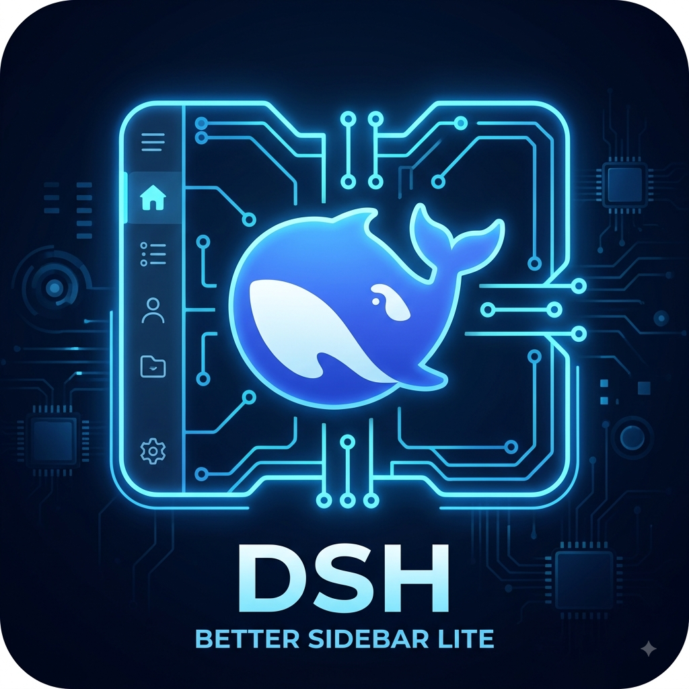

# dsh-better-sidebar-lite



A right-side tabbed sidebar for [DeepSeek Harness](https://github.com/deepseek-ai/deepseek-harness) (dsh) **web**: **explorer** (workspace file tree) and **git** (changes & commits) tabs, built on an extensible **tab registry**.

> **Status: development build in this workspace — NOT installed into any running dsh deployment.**
> Installing is a documented, deliberate step (see Installing below).

## TLDR;
- Quick install via NPM:

```
dsh plugin add dsh-better-sidebar-lite --profile web
```
--- 

---


## What it is

Two halves of one cordis plugin:

- **Host half** (Node): registers the generic Connection RPC channel `/better-sidebar` with `authority: loopback` and serves nine endpoints: `explorer/list`, `explorer/stamp` (auto-refresh change stamps), `git/status`, `git/log`, `git/stage`, `git/unstage`, `git/commit-detail` (full message + changed files of one commit), `git/commit` (stage + commit), and `git/discard` (restore/clean). Filesystem access uses `node:fs/promises`; git runs via a spawn wrapper with fixed arguments, optional stdin for commit messages, timeout and abort support — no shell interpolation.
- **Client half** (browser): registers one entry into the layout's right `details` column (declared by ui-layout AppFrame; priority -1 shadows ui-conversation's DetailsPanel) that renders the sidebar with a tab bar. Because the dock is a real grid column, the conversation shrinks beside it — it never overlaps the main UI. The dock tab set comes from `ctx.betterSidebar.tabs`, a registry any plugin can contribute to.

Data flow (one round trip):

```
Tab panel -> ctx.betterSidebar.rpc.call(endpoint, payload, { signal })
          -> ctx.connection.rpc.call(channel, ...)   (browser)
          -> host dispatch -> ExplorerService / GitService -> fs / git
          -> SidebarResult<T> in the RPC value slot (ADR-002)
```

## Architecture

- **src/contract** — dependency-free shared types: endpoint table, payloads, tree/git models, the SidebarResult error envelope, payload guards. Single source of truth for both halves.
- **src/host** — cordis plugin entry (Config, inject connection), ExplorerService (lazy per-directory listing, dirs-first locale sort, symlinks never followed, entry caps), GitService (porcelain v1 -z parser, log format, rev-parse probe, stage/unstage), path safety (absolute-root validation + optional allowedRoots confinement).
- **src/client** — cordis plugin entry providing `ctx.betterSidebar` (`{ rpc, tabs, explorer }`), the dock (the frame's right `details` column: open/close via `ctx.layout`, native drag resize, AppFrame's column border), the tab registry, the explorer and git tabs, inline-SVG icons, and en/zh locales.

Decisions are recorded in docs/adr/ (architecture, transport & error model, tab registry & dock, explorer & git scope). Design docs live in docs/design/. The dsh API facts everything builds on are in docs/architecture-brief.md.

## Model Experience

Explorer and git are pure browser chrome: nothing here reaches a model request. The tabs render host filesystem and git state, fetched over the loopback RPC channel.

#### Token effect

Zero — no prompts, tool schemas, or model context are assembled or sent.

#### KV Cache effect

None; this package neither assembles nor sends a provider request.

## Installing into a dsh web deployment (later)

Not installed here; when the owner authorizes, the steps are:

1. **Host**: load the plugin entry in the host cordis config (e.g. cordis.yml plugins section) — the entry exports `name`, `inject: [connection]`, `Config`, and `apply(ctx, config)`. The `client-connection` plugin (which provides `ctx.connection`) must load first.
2. **Client**: include the `./client` entry in the web bundle client plugin set (the dsh web loader module table). The plugin requires connection, slots, locale, and layout services and the `details` slot (declared by ui-layout AppFrame). The dock is session-scoped like dsh's native details column: it shows while a conversation is current.
3. **Trust fence**: the channel is registered with `authority: loopback` — non-loopback browsers are refused by the connection layer before the handler runs. The host also validates every payload path (absolute, existing, directory, inside allowedRoots when configured).

## Config reference

| Field | Type | Default | Meaning |
|---|---|---|---|
| `allowedRoots` | string[] | `[]` | Absolute roots the plugin may read; empty = any absolute directory the host process can read. Entries must be absolute (validated at load). |
| `gitTimeoutMs` | number | `15000` | Per git command timeout (clamped 100-120000). |
| `maxEntriesPerListing` | number | `2000` | Per-directory listing cap; excess is truncated with a flag. |
| `maxLogEntries` | number | `100` | `git log -n` cap / page size clamp. |
| `maxStatusEntries` | number | `20000` | git status entry cap. |
| `untrackedFiles` | all or normal | `all` | Porcelain untracked mode; `normal` collapses all-untracked dirs into `dir/` entries. |
| `hidePatterns` | string[] | `['.git','node_modules']` | Basenames filtered from listings (no reveal toggle in v1). |
| `gitExecutable` | string | `git` | Test/override seam. |

## Extension guide — add a tab

Any client plugin can contribute a tab:

```ts
import type { ClientContext } from '@deepseek-ai/dsh-client-runtime/client'
import type { TabDef } from 'dsh-better-sidebar-lite/client'

export function apply(ctx: ClientContext): void {
  ctx.effect(() => {
    const dispose = ctx.betterSidebar.tabs.register({
      id: 'my-tab',
      order: 30,                                  // sorts after explorer(10), git(20)
      label: () => 'My tab',                      // locale-aware via a function
      icon: <MyIcon />,                           // inline SVG
      badge: () => undefined,                     // optional live badge
      renderPanel: () => <MyPanel />,             // renders inside the dock
    })
    return dispose
  }, 'my-plugin: tab')
}
```

Requirements: a stable unique `id` (duplicates throw TabRegisterError), registration inside `ctx.effect` (unload disposes), and panel components that read dsh session/workspace data through `useDock()` (the context the dock provides around every panel) or through props captured by the factory.

Built-in tabs are the reference implementation: explorer (id explorer, order 10) and git (id git, order 20), registered in the plugin own `apply` through the same public API.

## Error codes

Domain errors travel inside the RPC **value** slot as `SidebarResult<T>` (ADR-002 — dsh `RpcError` is a closed union; a plugin code in the error slot would break the browser response parser). The transport error slot is used only by the connection layer itself.

| Code | Meaning |
|---|---|
| `not-found` | Path does not exist |
| `permission-denied` | fs read denied (EACCES/EPERM) |
| `not-directory` | Expected a directory |
| `symlink-loop` | ELOOP during stat |
| `path-too-long` | Payload path over the 4096-char guard |
| `invalid-root` | Root validation failure (relative path, ...) |
| `outside-allowed-root` | Root outside configured allowedRoots |
| `not-a-repo` | Path is not inside a git work tree |
| `git-missing` | git binary not found on PATH |
| `git-failed` | git exited with an error (stderr tail capped) |
| `timeout` | git command exceeded gitTimeoutMs |
| `cancelled` | Caller aborted the request |
| `param-invalid` | Payload failed the contract guard |
| `internal` | Unexpected host failure / transport down (host unavailable) |

## Development

**Prerequisite — sibling dsh checkout.** This repo consumes the DeepSeek
Harness checkout as a read-only sibling: clone `deepseek-harness` into the
same parent directory as this repo (i.e. `../deepseek-harness` next to this
repo). No absolute paths are stored anywhere; every reference is relative.

```
parent/
├── deepseek-harness        # sibling checkout (read-only, packages prebuilt)
└── dsh-better-sidebar-lite # this repo
```

```
pnpm install     # toolchain (react 18.3.1, vitest 4, typescript 6, oxlint) + link: deps
pnpm typecheck   # tsc -p host + client against the dsh checkout built types
pnpm typecheck:tests
pnpm test        # vitest projects: host (node) + client (jsdom)
pnpm build       # tsc emits lib/{host,client,contract}; CSS mirrored into lib/client
pnpm lint        # oxlint
```

The test suite needs a real `git` on PATH (git-service tests script a real repo under a temp dir). The dsh checkout is wired in three ways, all relative: `tsconfig.base.json` `paths` (built `.d.ts` for `tsc`), `tsconfig.vitest.json` + `vitest.config.ts` aliases (dsh **source** for vitest — never the built module-loader bundles), and `@deepseek-ai/schemastery` in `devDependencies` as `link:../deepseek-harness/vendor/schemastery` (the one host-side runtime import; `pnpm install` creates the junction in `node_modules/@deepseek-ai/`). The client tests force a single React instance (see the comments in `vitest.config.ts`).

## Known limitations (v1)

- Explorer auto-refreshes via the session dirty-signal and an 8s change-stamp poll (`explorer/stamp`, ADR-004), so agent-written and external tree changes appear without manual refresh. On filesystems with coarse (1s) timestamp granularity, two rapid changes to the same directory may be merged until the next change; the manual refresh button remains the backstop. The explorer has no hidden-file reveal toggle, no multi-select, no virtualization.
- Git supports the full working-tree loop: stage/unstage, commit (staged or "include all"), and discard (per-file or all untracked+unstaged) — but no diff CONTENT preview and no stash; no merge badge (contract lacks a parents field). Commit/discard are destructive and gated by the UI's confirm dialog; discard restores tracked files from HEAD and cleans untracked ones.
- The dock owns the frame's right `details` column, so dsh's built-in tool-details viewer (click a tool call to inspect its input/output) is replaced by the sidebar. The details track only opens for a current NON-blank session on a wide-enough viewport (AppFrame gates both) — when it is closed the dock floats at the right edge instead of vanishing, and docks back in-flow once the column opens. Collapse shrinks it to a 56px tab rail (click a tab or the expand chevron to restore; Ctrl/Cmd+Shift+B toggles); without any current session the dock does not mount (dsh's native details behavior).
- Open-file events are emitted but no editor consumes them yet.