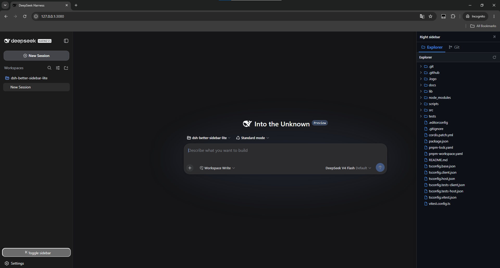
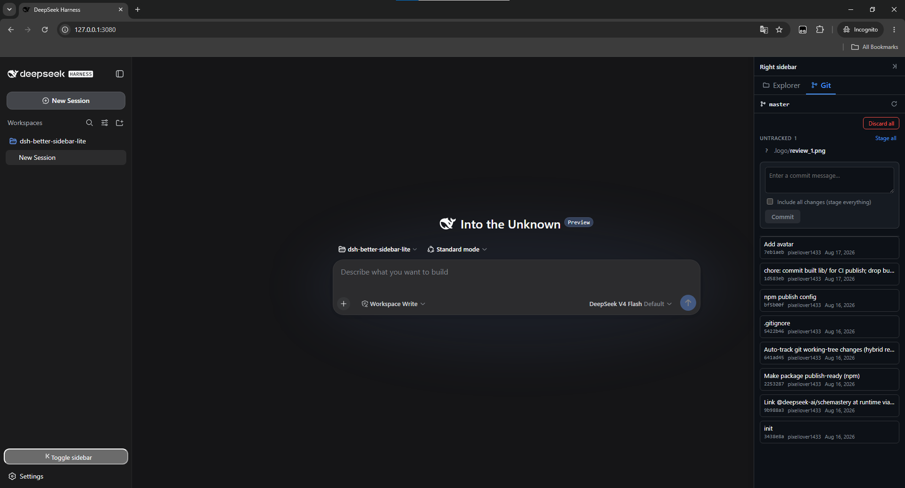
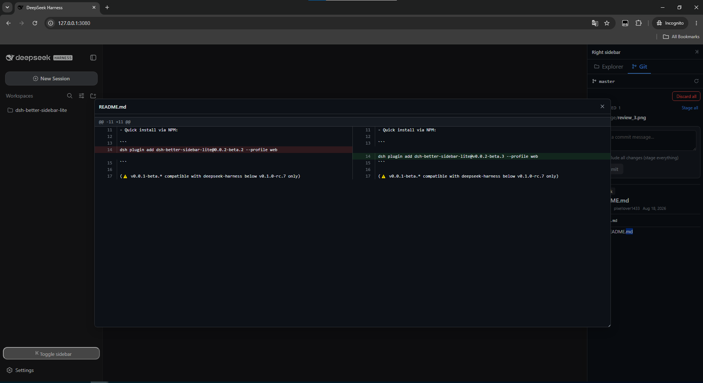

[](https://www.npmjs.com/package/dsh-better-sidebar-lite)
[](https://www.npmjs.com/package/dsh-better-sidebar-lite)
[](https://www.npmjs.com/package/dsh-better-sidebar-lite.svg)


<div align="center">
  
</div>

# ;TLDR
Add a sidebar to the right side of the workspace screen with usefull tabs:
- Explorer
- Git
- Skills (coming soon...)
- ...

# How to install 

```
dsh plugin add dsh-better-sidebar-lite@0.0.3-beta.2 --profile web
```

⚠️ **WARNING:** Make sure to install Deepseek Harness version 0.1.0-rc.7 or higher...

# What is does ? (0.0.3-beta.2)
Add a sidebar to the right side of the workspace screen. This area will contain tabs displaying various pieces of information, including:
- **Editor**: Modal editors support viewing the content of objects.
- **Explorer**: 
  - Display the workspace folder tree. 
  - Supports viewing file contents by double-clicking on any file. (will trigger `Editor` to show content of file)
  - Automatically track changes in the workspace.
- **Git**:
  - View the changes made to any object, highlight changes, add new items, delete items, etc... 
  - Automatically track changes, displaying files that have been changed or modified (git diff tracking).
  - Commit, stage, discard change  
  - Commit history
- ***Skills*:
  - Will display a list of skills that the current agent (preset) has loaded/will load into.
- Synchronize the light/dark mode of your Deepseek Harnes profile.
- Allows for custom configurations through the settings from the Deepseek Harness configuration interface.


# The author's vision and future direction.

- Develop additional suitable features while maintaining the original philosophy of "simplicity and effectiveness".
- Share additional plugins, system prompts, and other skills suitable for the Deepseek Harness system.
- Support and contribute to the Deepseek Harness community.
- Complete the challenge set for myself: 365 days (and beyond) of partnership with Deepseek Harness.

# Printshot 



