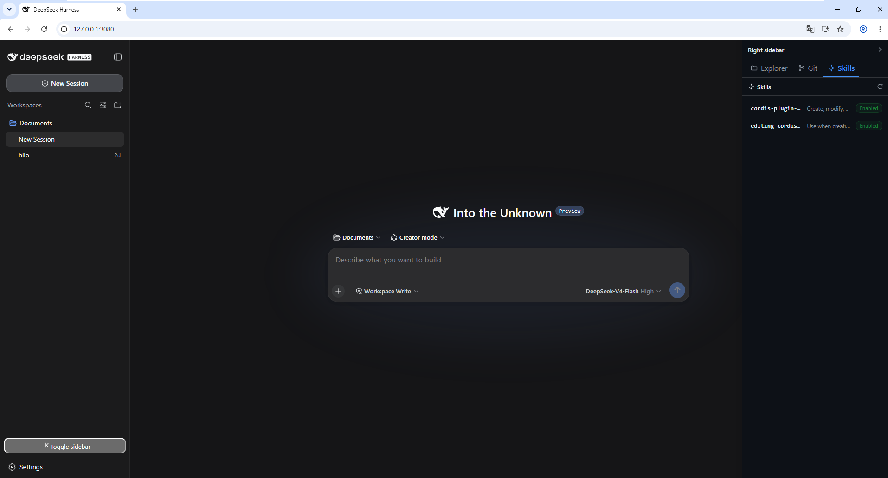

[](https://www.npmjs.com/package/dsh-better-sidebar-lite)
[](https://www.npmjs.com/package/dsh-better-sidebar-lite)
[](https://www.npmjs.com/package/dsh-better-sidebar-lite.svg)
**🌐 語言 / Language:** [English](./README.md) · [繁體中文](./README.zh-TW.md)


<div align="center">
  
</div>

# 總覽
在工作區畫面的右側加入一個側邊欄，內含實用的分頁：
- **資源管理器 (Explorer)**
- **Git**
- **技能 (Skills)**（即將推出...）
- ...

# 如何安裝

```
dsh plugin add dsh-better-sidebar-lite@0.0.4-beta.1 --profile web
```

⚠️ **警告：** 請確保安裝 0.1.0-rc.7 或更高版本的 Deepseek Harness...

# 此插件的作用 ? (0.0.4-beta.1)
在工作區畫面的右側加入一個側邊欄。此區域會包含顯示各種資訊的分頁，包括：
- **編輯器 (Editor)**：用於檢視物件內容的 Modal 編輯器。
- **資源管理器 (Explorer)**：
  - 顯示工作區的資料夾樹狀結構。
  - 支援對任何檔案按兩下以檢視其內容。（將觸發 `Editor` 顯示檔案內容）
  - 自動追蹤工作區的變更。
- **Git**：
  - 檢視對任何物件所做的變更、標示變更、新增項目、刪除項目等...
  - 自動追蹤變更，顯示已更改或修改的檔案（git diff 追蹤）。
  - 提交 (commit)、暫存 (stage)、捨棄變更 (discard change)
  - 提交歷史
- **技能 (Skills)**：
  - 顯示目前代理程式（預設）已載入／將載入的技能清單。
  - 檢視目前工作階段的技能清單及其狀態（啟用／停用）
  - 檢視技能的內容
  - 檢視技能使用的參考檔案
- 同步您 Deepseek Harness 設定檔的深色／淺色模式。
- 允許透過 Deepseek Harness 設定介面中的設定進行自訂配置。


# 作者的願景與未來方向

- 在維持「簡單而有效」的初衷下，開發更多合適的功能。
- 分享更多適合 Deepseek Harness 系統的其他插件、系統提示詞與其他技能。
- 支援並貢獻於 Deepseek Harness 社群。
- 完成為自己設定的挑戰：與 Deepseek Harness 合作的 365 天（以及更久）。

# 截圖


